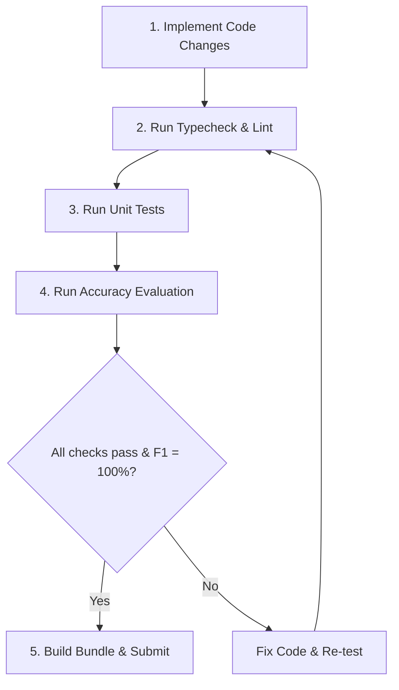

# Contributing to DeepScan

Thank you for your interest in contributing to DeepScan! To maintain the highest standards of reliability, performance, and accuracy for our users, we enforce a strict development and testing workflow. Please read and follow these guidelines before submitting any changes.

---

## 📜 Core Development Rules

### 1. Strict Type Safety & Clean Code
- **TypeScript**: All new code must be fully typed. Avoid using `any` unless absolutely necessary.
- **Verification**: Run TypeScript compilation checks before finalizing code:
  ```bash
  npm run typecheck
  ```
- **Linting & Formatting**: Follow existing style patterns. Code must pass lint checks:
  ```bash
  npm run lint
  ```

### 2. Comprehensive Unit Testing
- **Coverage**: Any new feature, utility, configuration option, or parser logic must be accompanied by corresponding unit tests in the `tests/` directory.
- **Regression Testing**: All existing unit tests must pass cleanly without warning or validation errors:
  ```bash
  npm run test
  ```

### 3. Maintain 100% Benchmark Accuracy (Recall & Precision)
DeepScan is built with a zero-false-positive design philosophy for realistic code. We verify this using an automated evaluation monorepo under `examples/`.
- **The Rule**: Any changes made to scanning rules, analyzers, or core engines must not break the benchmark target.
- **Validation**: You must run the evaluation script to ensure we maintain **100% Recall** (catching all expected ground-truth bugs) and **100% Precision** (triggering zero false alarms on safe code):
  ```bash
  npm run evaluate
  ```
- **F1 Score**: The overall F1 Score must remain at exactly **100.0%**. If your changes drop this metric, they will be rejected.

### 4. Efficient File Scanning & Exclusions
- **No Overhead**: Never scan dependency folders (`node_modules/`, `vendor/`), build outputs (`dist/`, `build/`), or environment directories (`.venv/`, `venv/`).
- **Recursive Rules**: Always specify exclude patterns in a recursive format (e.g. `node_modules/` or `**/node_modules/**`) so directories are ignored across all deep subdirectories of a target project.
- **Large Files**: Keep the 5MB file size limit in place to prevent scanning hangs on bundle assets or minified files.

### 5. Standard Security Severity Levels
- **Allowed Levels**: Findings must only use the standardized security severities: `critical`, `high`, `medium`, or `low`.
- **No Lint Levels**: Never use generic linting levels (`error`, `warning`, `info`) in rule engines, presets, overrides, or output logic.

---

## 🔄 Step-by-Step Contribution Workflow

Follow this checklist for every change:



### Step 1: Make your changes
Make your edits within the `src/` directory. If you are updating rules, make sure to execute the rules update script:
```bash
npm run rules:update
```

### Step 2: Verify code health
Run static analysis and type checks:
```bash
npm run typecheck
npm run lint
```

### Step 3: Run the test suite
Verify that all unit and integration tests are passing:
```bash
npm run test
```

### Step 4: Run the accuracy evaluation
Run the monorepo benchmark and verify the output inside `evaluation-summary.txt` and `evaluation-report.html`:
```bash
npm run evaluate
```
Confirm that no new False Positives (FPs) are generated, and all expected vulnerabilities are caught (Recall = 100%, Precision = 100%).

### Step 5: Build for production
Build the final Javascript bundles to ensure the package bundles correctly:
```bash
npm run build
```

---

## 🚨 Guidelines for Adding Rules
When adding new rules in `rules/built-in/`:
- **Unique IDs**: Use prefix namespaces (e.g., `security/`, `quality/`).
- **Clear Messages**: Provide actionable remediation messages and reference links (e.g. OWASP/CWE links).
- **Safe Equivalents**: For every vulnerable pattern added to `examples/` to test a new rule, you **must** also add a corresponding `safe` version in the benchmark code to verify that the scanner does not flag it as a False Positive.
